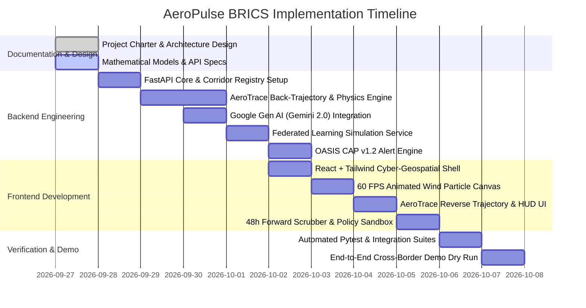

# AeroPulse BRICS: Project Charter & Strategic Plan

**Project Title**: AeroPulse BRICS: Cross-Border AI Climate Intelligence & Industrial Source Attribution Network  
**Hackathon Event**: *Build with AI: Code for Communities (Second Edition)*  
**Organizers**: Google Cloud & Google Developer Groups (GDG) India  
**Target Theme**: BRICS Sustainability, Resilience, Innovation & Cross-Border Cooperation  
**Mandatory Tech**: Google Gen AI SDK (Gemini 2.0 Flash / Google AI Studio)  

---

## 1. Executive Summary & Problem Framing

### The Crisis
Air pollution is indifferent to administrative and national borders. In major economic corridors across BRICS nations (such as the Indo-Gangetic Plain, the Southern African Highveld Basin, and the Pan-Amazonian Biomass Arc), severe atmospheric pollution crises consistently trigger public health emergencies, hospital surges, and cross-border geopolitical friction.

### The Systemic Failure of Current Solutions
1. **The Temporal Blind Spot**: Satellites (e.g., Sentinel-5P, MODIS) provide valuable macro-level columns but pass only 1–2 times daily and are blinded by cloud cover or heavy fog.
2. **The Spatial Blind Spot**: Government monitoring stations are sparse and clustered in city centers, missing midnight industrial releases, brick kiln emissions, and rural agricultural burning at provincial borders.
3. **The Finger-Pointing Impasse**: When trans-boundary smog blankets downwind cities, authorities trade accusations because neither side possesses objective, physics-backed proof of where the plume originated or how much pollutant mass crossed the border.
4. **Sovereignty Deadlock**: Border security and industrial confidentiality laws prevent nations from sharing raw sensor telemetry and high-resolution border imagery with international partners.

### The AeroPulse Solution
AeroPulse bridges this divide through:
- **AeroTrace (Multimodal Reverse Plume Attribution)**: Ingests citizen smartphone photos and low-cost sensor spikes, classifies the pollution type with **Google Gemini 2.0 Flash**, runs reverse meteorological back-trajectory physics, and pinpoints candidate culprit factories/fires within the upwind radius with exact transit distances and times.
- **Physics-Guided 48-Hour Forward Forecaster**: Simulates advection-diffusion corridor plumes forward in time, providing a 24- to 48-hour early warning window for downwind communities.
- **Cross-Border Virtual Flux Gate**: Calculates the net mass transport rate ($\text{kg/hour}$) crossing international or provincial borders.
- **Sovereign Federated Learning**: Allows BRICS national environmental nodes to collaboratively improve predictive AI models by sharing mathematical weights without exporting sensitive raw ground telemetry.
- **OASIS CAP v1.2 Bilateral Emergency Alerts**: Dispatches simultaneous, coordinated emergency action protocols to both upwind regulators and downwind public health authorities.

---

## 2. Alignment with Hackathon Pillars

| Hackathon Pillar | How AeroPulse Addresses It |
|---|---|
| **Sustainability** | Mitigates persistent environmental degradation, prevents agricultural/industrial emission surges, and optimizes clean air corridor policies across developing economies. |
| **Resilience** | Gives hospitals, schools, and vulnerable communities a 24- to 48-hour head start before toxic plumes arrive, enabling proactive mask distribution, smog cannon deployment, and activity restrictions. |
| **Innovation** | Fuses **Google Gemini 2.0 Multimodal AI** with Lagrangian atmospheric back-trajectory physics and Federated Learning (`FedAvg`) to solve source attribution and privacy simultaneously. |
| **Cooperation** | Replaces political blame games with transparent, mathematical cross-border flux gates and OASIS CAP v1.2 international disaster coordination protocols across BRICS nations. |

---

## 3. Stakeholder Ecosystem & User Personas

```
┌─────────────────────────────────────────────────────────────────────────────┐
│                       AeroPulse Stakeholder Ecosystem                       │
├───────────────────────┬──────────────────────────┬──────────────────────────┤
│ Trans-Boundary        │ Sovereign Environmental  │ Borderland Citizen       │
│ Environmental Board   │ Regulatory Authority     │ (Air Guardian)           │
├───────────────────────┼──────────────────────────┼──────────────────────────┤
│ Goals:                │ Goals:                   │ Goals:                   │
│ - Monitor border flux │ - Inspect culprit plants │ - Report local smoke     │
│ - Validate source     │ - Enforce curtailment    │ - Check street-level AQI │
│ - Coordinate alerts   │ - Maintain sovereign data│ - Receive health warnings│
│ Core UI:              │ Core UI:                 │ Core UI:                 │
│ - 3D Digital Twin     │ - AeroTrace Inspector    │ - Mobile PWA Camera Tool │
│ - Flux Gate Telemetry │ - Federated Node Pod     │ - Local Air Shield HUD   │
│ - Joint CAP Feed      │ - 'What-If' Sandbox      │ - Health Advisory Panel  │
└───────────────────────┴──────────────────────────┴──────────────────────────┘
```

---

## 4. Key Performance Indicators (KPIs) for Success

1. **Attribution Latency**: Complete photo ingestion, Gemini visual reasoning, and reverse trajectory radius calculation in $< 2.5\text{ seconds}$.
2. **Spatial Accuracy**: Identify upwind culprit industrial candidates within a $\pm 15^\circ$ wind dispersion cone up to $50\text{ km}$ distance.
3. **Forecasting Horizon**: Deliver accurate 48-hour forward advection-diffusion plume contours discretized into 1-hour timesteps.
4. **Data Privacy**: Ensure 100% zero transmission of raw citizen telemetry or sensitive national industrial coordinates during federated model aggregation rounds.
5. **Standardization**: Produce 100% schema-valid OASIS CAP v1.2 XML/JSON alerts compatible with national disaster management frameworks.

---

## 5. Development Roadmap & Milestones


