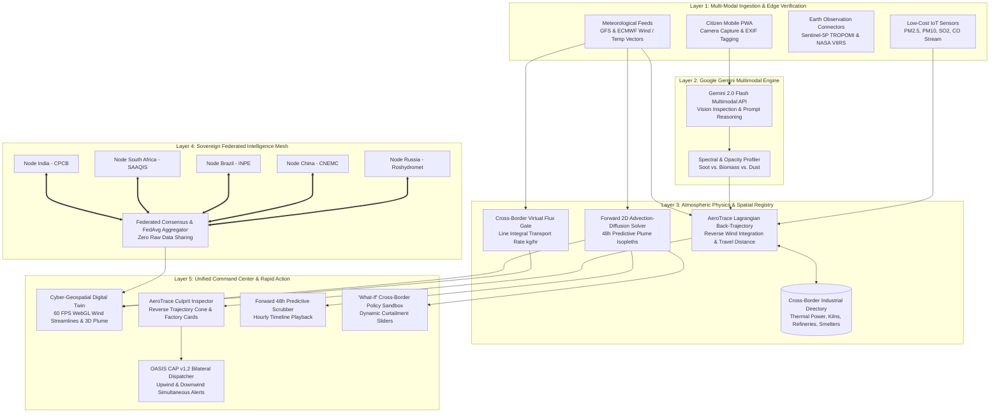
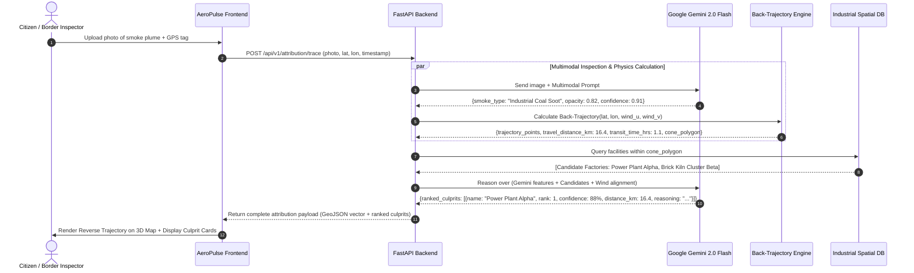
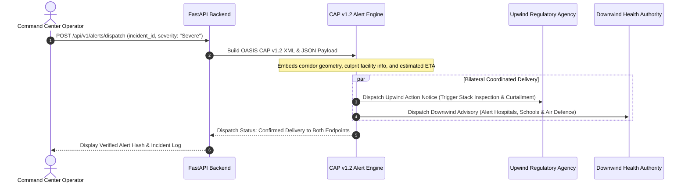
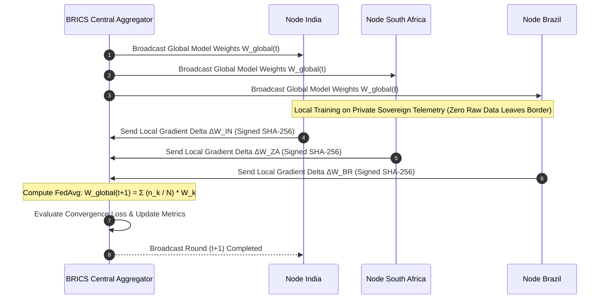

# AeroPulse BRICS: System Architecture & Data Flow

This document details the multi-layered system architecture, component interactions, and sequence workflows for the **AeroPulse BRICS** platform.

---

## 1. High-Level Architectural Topology

---

## 2. Component Descriptions

### 2.1 Layer 1: Ingestion & Edge Privacy
- **Citizen Camera Ingestion**: Collects geolocated smartphone images of smoke plumes or haze.
- **Privacy Shield (Geohash Truncation)**: Fuzzes citizen coordinates to Level 6 geohash precision ($\sim 1.2\text{ km}^2$) to preserve civilian privacy and protect against surveillance.
- **Sensor Adapters**: Standardized REST/MQTT endpoints receiving particulate readings ($\mu\text{g/m}^3$) from low-cost optical particle counters (e.g., Plantower PMS5003, Sensirion SPS30).
- **Satellite & Weather Adapters**: Ingests active fire thermal points from NASA FIRMS (VIIRS 375m) and wind vector fields $(u, v)$ at 10m and 850 hPa isobaric levels.

### 2.2 Layer 2: Google Gemini Multimodal Engine
- **Model**: `gemini-2.0-flash` accessed via the `google-genai` Python SDK.
- **Role**: 
  1. Inspects the uploaded image for optical extinction, plume color profile (dark gray/black indicating incomplete combustion of heavy fuel/coal; yellowish/white indicating moisture or chemical acid mist; orange/brown indicating biomass/stubble fire).
  2. Estimates plume boundary geometry, stack elevation angle, and visual opacity percentage.
  3. Synthesizes physical evidence to produce structured JSON attribution reasoning.

### 2.3 Layer 3: Atmospheric Physics & Spatial Registry
- **AeroTrace Back-Trajectory Engine**:
  - Computes the backward particle trajectory from observation point $\vec{x}_{\text{obs}}$ against the wind flow.
  - Integrates total transit distance ($d_{\text{travel}}$ in km) and transit time ($\tau$ in hours).
  - Generates a Gaussian dispersion cone angle $\theta = \pm 15^\circ$ expanding upstream to account for turbulent eddy diffusivity.
- **Cross-Border Industrial Directory**:
  - Spatial catalog with verified coordinates, fuel type (coal, petcoke, furnace oil, biomass), stack height, and operating schedules.
  - Executes spatial containment queries (`ST_DWithin` & angular sector checks) within the back-trajectory cone.
- **Forward Advection-Diffusion Solver**:
  - Solves the transport differential equation for the entire corridor over $t \in [0, 48]\text{ hours}$.
- **Cross-Border Flux Gate**:
  - Calculates line integrals across national/provincial border segments to quantify cross-border transport in $\text{kg/hour}$.

### 2.4 Layer 4: Sovereign Federated Intelligence Mesh
- **Sovereign Isolation**: Raw training datasets (sensitive industrial monitoring, high-resolution satellite passes, residential air data) never leave the sovereign boundary.
- **Parameter Aggregation**: Local model gradients are trained on national nodes and transmitted via TLS to the BRICS Aggregator.
- **FedAvg Protocol**: Evaluates round convergence, applies differential privacy noise, and broadcasts the improved global weights back to all nodes.

### 2.5 Layer 5: Command Center & Rapid Intervention
- **Geospatial Digital Twin**: MapLibre/Leaflet WebGL container with high-performance Canvas wind particle animation (2,500+ particles).
- **AeroTrace Inspector**: Displays the observation point, back-trajectory flight path, and interactive culprit factory cards ranked by attribution confidence.
- **OASIS CAP v1.2 Dispatcher**: Generates standard international emergency XML/JSON alerts with coordinated bi-lateral protocols for both upwind and downwind authorities.

---

## 3. Detailed Sequence Workflows

### Sequence 1: AeroTrace Reverse Plume Source Attribution

---

### Sequence 2: Bilateral OASIS CAP v1.2 Cross-Border Alert Dispatch

---

### Sequence 3: Sovereign Federated Learning Model Update Round

